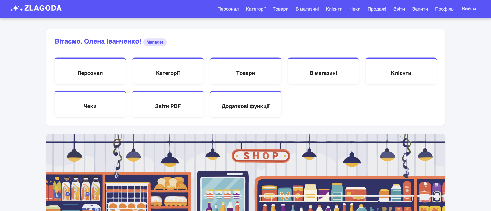
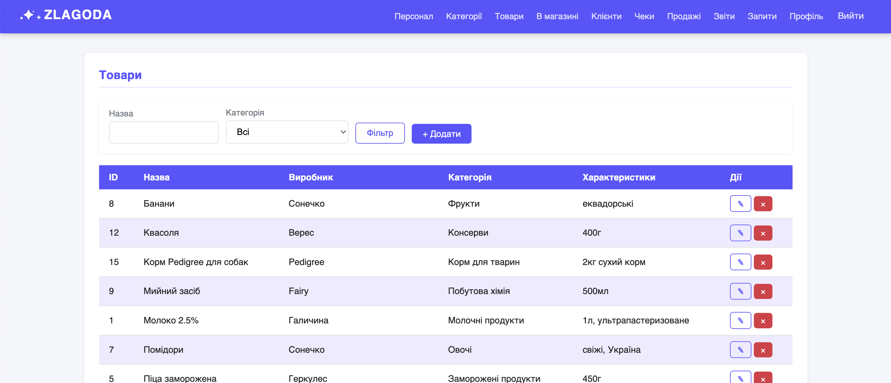
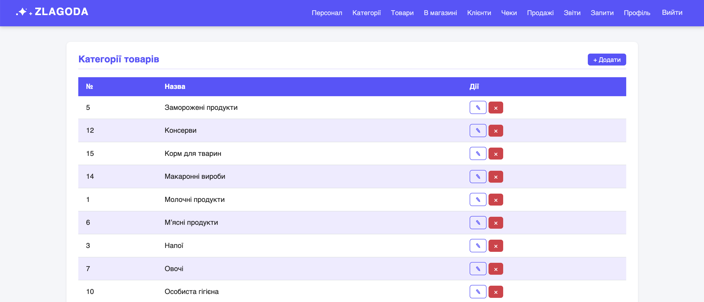
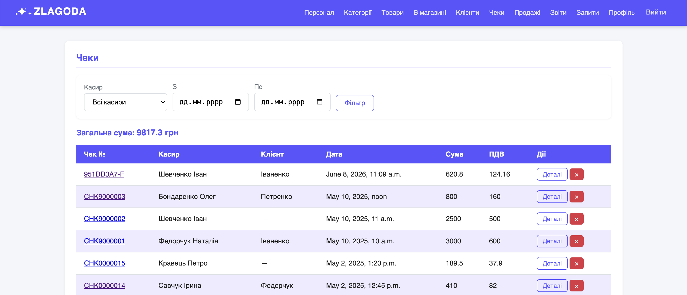
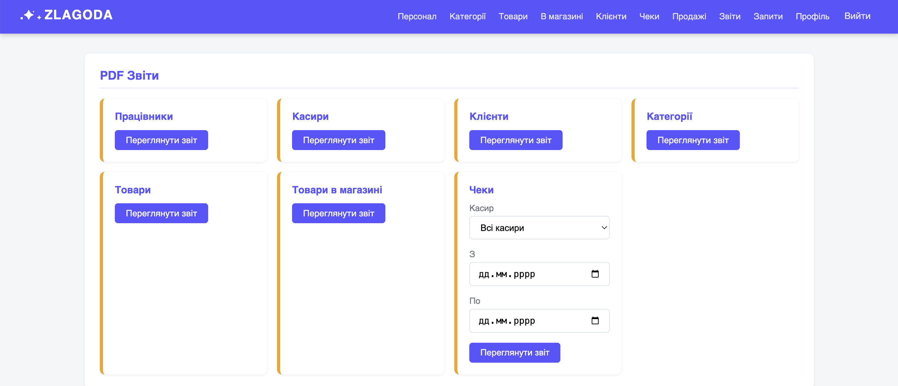
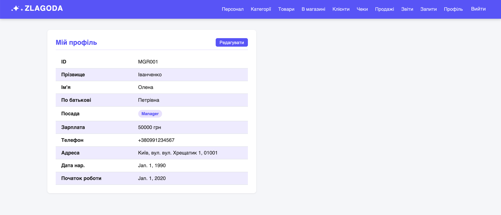

# Система управління супермаркетом «Злагода»
## Опис проєкту
«Злагода» — це вебсайт для управління діяльністю супермаркету який дозволяє вести облік товарів, категорій, працівників, клієнтів, чеків та продажів через зручний вебінтерфейс.

## Використані технології
- Python
- Django
- SQLite
- HTML/CSS
- JavaScript

## Основні сторінки
| Головна | Товари |
|--------|--------|
|  |  |

| Категорії | Чеки |
|--------|--------|
|  |  |

| Звіти | Профіль |
|--------|--------|
|  |  |

Та інші...

## Як запустити проєкт

### 1. Клонування репозиторію
```bash
git clone <URL_репозиторію>
cd <назва_папки_проєкту>
```

### 2. Створення віртуального середовища
```bash
python3 -m venv venv
```
```bash
source venv/bin/activate   # Mac/Linux
# venv\Scripts\activate    # Windows
```

### 3. Встановлення залежностей
```bash
pip install -r requirements.txt
```

### 4. Налаштування бази даних
```bash
python manage.py migrate
```

### 5. Створення суперкористувача (адмін)
Щоб мати доступ до адміністративної панелі:
```bash
python manage.py createsuperuser
```

### 6. Запуск сервера Django
```bash
python manage.py runserver
```
Бекенд буде доступний за адресою: http://127.0.0.1:8000/
Адмінка: http://127.0.0.1:8000/admin/
